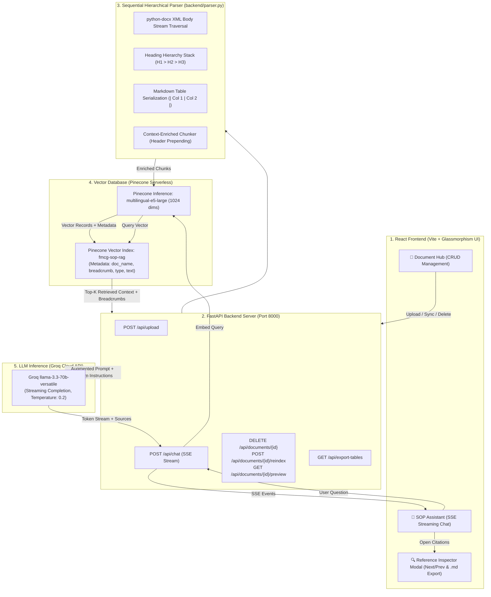

# Complete Technical Documentation & Architecture Blueprint

## Context-Preserving SOP RAG Intelligence Engine

---

## 1. Executive Overview & Problem Statement

Standard Retrieval-Augmented Generation (RAG) pipelines frequently fail when processing **complex enterprise Standard Operating Procedure (SOP) documents**. These documents contain deep hierarchical sections, technical tolerances, and multi-column tabular data (e.g., RACI accountability matrices, engineering parameters, SLAs).

### Why Traditional RAG Fails on DOCX Files:

1. **Separation of Paragraphs & Tables**: Standard text extractors process text and tables in isolated buffers, destroying the spatial and sequential flow of the document.
2. **Cell Context Loss**: In naive token/character splitters, a table row like `| SLES 70% | 50 MT | 14 Days | Vendor A |` loses which product, phase, or chemical grade it belongs to because the column headers and section titles are split into earlier chunks.
3. **High Re-indexing Costs**: Traditional vector stores require re-indexing the entire database when any document is updated, wasting API calls and cloud storage resources.

### Our Solution:

This project implements an **end-to-end, hierarchical, context-preserving RAG system** designed specifically for structured DOCX enterprise documentation. It features:

* **Sequential XML Parsing** preserving chronological reading order.
* **Dynamic Breadcrumb Enrichment** prepending section paths (`Doc > H1 > H2 > H3`) to every chunk.
* **Markdown Table Serialization** maintaining multi-column tabular semantics for LLMs.
* **Pinecone Serverless Vector Database** with **Incremental Single-Document Sync (CRUD)**.
* **Ultra-Fast LLM Inference** via **Groq** using `llama-3.3-70b-versatile`.
* **Glassmorphism React Frontend** with real-time SSE streaming, interactive **Reference Inspector Modal**, and one-click `.md` table export.

---

## 2. Complete End-to-End System Architecture



---

## 3. Data Flow & Life of a Query (Step-by-Step)

### Phase A: Document Ingestion & Vectorization

1. **Upload / Local Storage**: A `.docx` file (e.g. FMCG Shampoo SOP or LED Tubelight SOP) is stored in the `data/` directory.
2. **Sequential XML Parsing**: [backend/parser.py](file:///c:/Z_Pratik/Technology/delete_asap/Word_POC/backend/parser.py) reads body elements sequentially (`w:p` paragraphs and `w:tbl` tables in exact document order).
3. **Hierarchy Stack Tracking**: The parser maintains an active heading stack:
   $$
   \text{Breadcrumb} = \text{Doc Title} \rightarrow \text{Heading 1} \rightarrow \text{Heading 2} \rightarrow \text{Heading 3}
   $$
4. **Table Serialization**: Every table is converted to a clean Markdown matrix with header rows, cell pipe escaping, and formatting.
5. **Context-Enriched Chunking**: Each chunk (text or table) is prepended with its hierarchy metadata:
   ```markdown
   **Document Hierarchy:** STANDARD OPERATING PROCEDURE > LED Tubelight Operations > 2. RACI Matrix
   **Table Context:**
   | Stage | Process / Phase | Lead Responsibility (R) | Accountable (A) | ... |
   ```
6. **Vectorization**: Pinecone's serverless inference generates 1024-dimensional dense vectors using `multilingual-e5-large`.
7. **Upsert with Metadata**: Vectors are upserted with metadata: `doc_name`, `breadcrumb`, `content_type` (`text` or `table`), `raw_content`, and `text`.

---

### Phase B: Query Processing & Generation

1. **Query Dispatch**: User submits a question from the React chat interface (e.g., *"What Hi-Pot dielectric test voltage is enforced?"*).
2. **Query Vectorization**: FastAPI backend generates a query embedding using `multilingual-e5-large` with `input_type="query"`.
3. **Similarity Search**: Pinecone executes cosine similarity search across the vector index and returns the **Top-K (4)** most relevant chunks.
4. **Sources Sent Upfront**: The backend immediately yields a `sources` event over Server-Sent Events (SSE) containing chunk IDs, breadcrumbs, match scores, and raw Markdown tables.
5. **Prompt Augmentation**: The system builds a structured prompt combining the system instructions, retrieved context blocks with source headers, prior conversation turns, and user query.
6. **Streaming Generation**: Groq LLM (`llama-3.3-70b-versatile`) streams answer tokens in real-time.
7. **UI Rendering**: The React frontend renders real-time Markdown tables (`react-markdown` + `remark-gfm`), shows an animated thinking indicator, and displays interactive citation chips.

---

## 4. Models & AI Infrastructure Breakdown

| Component                        | Technology / Model                                     | Specifications & Configuration                                                                                   | Why Selected                                                                               |
| :------------------------------- | :----------------------------------------------------- | :--------------------------------------------------------------------------------------------------------------- | :----------------------------------------------------------------------------------------- |
| **LLM (Answering Engine)** | **Groq `llama-3.3-70b-versatile`**             | • 70 Billion Parameters• Context Window: 128k tokens• Temperature: `0.2`• Max Output: 2048 tokens          | Ultra-low latency inference (300+ tokens/sec), free API tier, high tabular reasoning.      |
| **Embedding Model**        | **Pinecone Inference `multilingual-e5-large`** | • Embedding Dimension:**1024**• Metric: **Cosine**• Max Input: 512 tokens with `truncate="END"` | Native serverless inference (no local PyTorch/GPU required), strong retrieval performance. |
| **Vector Database**        | **Pinecone Serverless**                          | • Cloud:`aws`• Region: `us-east-1`• Metric: `cosine`• Dimension: `1024`                              | Zero-infrastructure scaling, serverless metadata filtering for granular document CRUD.     |
| **Backend Framework**      | **FastAPI + Uvicorn**                            | • Python 3.12• Server-Sent Events (SSE)• Asynchronous Non-blocking IO                                         | High throughput, lightweight streaming support, typed Pydantic validation schemas.         |
| **Frontend Framework**     | **React + Vite**                                 | • Modern Vanilla CSS Design System• `react-markdown` + `remark-gfm`• `lucide-react` icons               | Lightning fast hot module reloading, rich glassmorphism UI, interactive modal drawers.     |

---

## 5. Component-by-Component Deep Dive

### 1. Sequential Element Parser (`backend/parser.py`)

* **`parse_document(file_path)`**: Traverses the DOCX XML element stream (`doc.element.body`). Differentiates `CT_P` (paragraphs, headings, lists) and `CT_Tbl` (tables) while maintaining exact chronological flow.
* **`table_to_markdown(table)`**: Converts `docx.table.Table` objects into clean GitHub Flavored Markdown (`| Header | ... |`), handling nested newlines and pipe escaping.
* **`create_chunks(file_path)`**: Packs document elements into atomic chunks (max 350 words, 50-word overlap) while **keeping tables atomic** whenever possible and prepending section breadcrumb headers.

### 2. RAG & Vector Engine (`backend/rag_service.py`)

* **`ensure_index()`**: Verifies that the Pinecone index exists; automatically provisions a 1024-dimension serverless index in `us-east-1` if missing.
* **`delete_document_vectors(doc_name)`**: Uses Pinecone metadata filter `{"doc_name": {"$eq": doc_name}}` to purge only the vectors belonging to a specific document.
* **`index_document(file_path, purge_existing=True)`**: Performs an **incremental sync** by purging old vectors for that document first, embedding new chunks, and upserting in batches.
* **`stream_chat(query, chat_history, top_k=4)`**: Orchestrates query embedding, similarity retrieval, and Groq streaming with upfront citation metadata delivery.

### 3. REST & Streaming API (`backend/api/`)

`backend/main.py` owns app configuration, CORS policy, and router registration. Route handlers are split across system, document, and RAG modules; document persistence and indexing orchestration live in `backend/services/document_service.py`.

* **`GET /api/status`**: Returns health check and configuration status for Pinecone and Groq.
* **`GET /api/documents`**: Returns active documents in `data/` along with file size, chunk counts, and table counts.
* **`DELETE /api/documents/{filename}`**: Removes local file from disk and purges its vectors from Pinecone.
* **`POST /api/documents/{filename}/reindex`**: Re-indexes only that single document without touching other vectors.
* **`GET /api/documents/{filename}/preview`**: Returns all parsed chunks and tables for structure inspection.
* **`GET /api/documents/{filename}/download-docx`**: Downloads the raw original `.docx` file.
* **`GET /api/export-tables?filename=...`**: Exports all parsed tables from a document as a clean `.md` file.
* **`POST /api/chat`**: Streaming SSE endpoint yielding source metadata and LLM tokens.

### 4. Interactive React Frontend (`frontend/src/`)

`App.jsx` coordinates workflow state and chat streaming. The document inventory/actions and reference inspector are reusable components under `frontend/src/components/`; shared prompt suggestions and confirmation text are in `frontend/src/constants.js`.

* **App Navigation Tabs**:
  * 💬 **SOP Assistant**: Chat view with suggested chips, thinking loader (`● ● ●`), and Markdown table styling.
  * 📁 **Document Management**: Inventory view with statistics cards, single-file sync, preview, table export, and deletion.
* **Reference Inspector Modal**:
  * Accessible from any citation chip.
  * Allows interactive `Prev` / `Next` pagination, keyboard arrow navigation (`←`/`→`), `Escape` close, and `.md` export.

---

## 6. How Incremental Sync Prevents Wasted Embeddings

Traditional RAG architectures rebuild the entire vector index on every upload, incurring linear cost growth.

```
[ Traditional RAG: Rebuild All ]
Update 1 File -> Re-embed Doc 1 + Doc 2 + ... + Doc N -> ❌ High Latency & High Cost

[ Our Incremental Architecture ]
Update Doc 2 -> Pinecone.delete(filter={"doc_name": "Doc 2"}) -> Embed Doc 2 Only -> ✅ 90%+ Cost Reduction
```

Every vector chunk is tagged with its parent `doc_name`. When a file is updated or deleted, Pinecone's metadata filtering purges only that document's vector partition, leaving all other documents untouched.

---

## 7. Sample Queries & Verification Matrix

| Query Tested                                                       | Expected Source Section        | Key Facts Extracted                                                                                    |
| :----------------------------------------------------------------- | :----------------------------- | :----------------------------------------------------------------------------------------------------- |
| **"Show RACI matrix for LED Tubelight R&D"**                 | Section 2 (RACI Matrix, Row 1) | • Responsible (R): Principal Electronics Engineer• Accountable (A): CTO• Consulted (C): Optical Lab |
| **"What are the Hi-Pot test parameters?"**                   | Phase 5 (Safety & Testing)     | • Voltage: 3,750V AC• Duration: 2.0s• Leakage Limit: < 0.5 mA                                       |
| **"What are the batch mixing parameters for Dove Shampoo?"** | Phase 3 (Manufacturing)        | • Temp: 60–70°C• pH: 5.5–6.5• High-shear mixing                                                  |
| **"What are the packaging line speeds?"**                    | Phase 3 & 4 (Packaging)        | • 180ml, 340ml, 650ml bottles at 250 units/min                                                        |

---

## 8. Directory & File Inventory

```
Word_POC/
├── backend/
│   ├── main.py                     # FastAPI REST & SSE Streaming Server
│   ├── parser.py                   # Hierarchical DOCX & Markdown Table Serializer
│   ├── rag_service.py              # Pinecone Vector DB + Groq Streaming Service
│   └── requirements.txt            # Python Dependencies
├── data/                           # Local SOP Document Storage
│   ├── Standard Operating Procedure (SOP) - End-to-End FMCG Shampoo...docx
│   └── Standard Operating Procedure (SOP) - End-to-End LED Tubelight...docx
├── frontend/                       # Vite + React Client
│   ├── src/
│   │   ├── App.jsx                 # Main Chat UI, Document Hub & Modal Inspector
│   │   ├── index.css               # Design System, Glassmorphism & Table Styles
│   │   └── main.jsx                # React DOM Root
│   ├── vite.config.js              # Vite dev server configuration + API proxy
│   └── package.json                # Frontend NPM dependencies
├── .env                            # Environment Variables (API Keys & Config)
├── .env.example                    # Reference Configuration Template
└── PROJECT_DOCUMENTATION.md        # Complete Architecture & System Documentation
```
